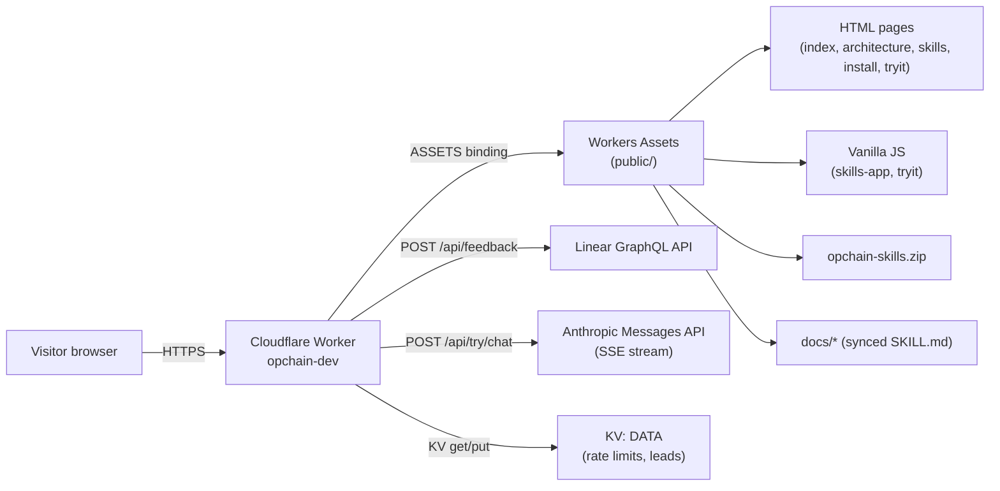
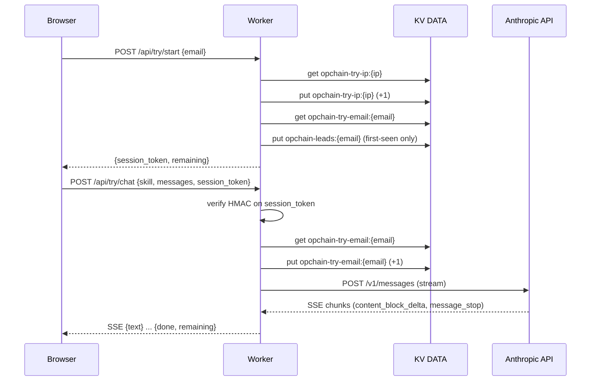
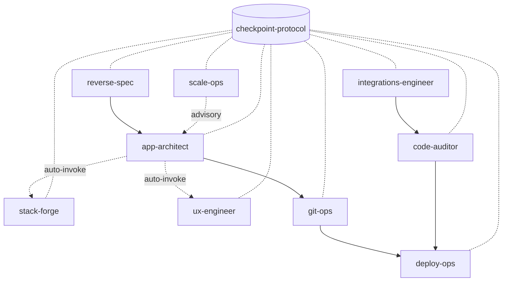

# 02 — Architecture

This spec documents **two architectures** in one repo:

1. The **Worker + showcase site** architecture (what runs at opchain.dev).
2. The **skills ecosystem** architecture (the product itself — how the 10 skills interrelate).

---

## Part A — Worker + Showcase Site

### System diagram



### Routing

The Worker's `fetch` handler (`src/index.js` L171–L223) dispatches in this order:

| Method + Path | Handler | Behavior |
|---|---|---|
| `OPTIONS /api/*` | inline | CORS preflight; returns 204 with origin-matched headers |
| `GET /api/health` | inline | `{ ok: true, service: "opchain-dev" }` |
| `POST /api/feedback` | `handleFeedback` | Creates Linear issue; 201 on success |
| `POST /api/try/start` | `handleOpchainTry` → `handleStart` | Email gate; returns HMAC session token |
| `POST /api/try/chat` | `handleOpchainTry` → `handleChat` | Streams Claude response (SSE) |
| `GET /` | inline | Rewrites to `/index.html` via ASSETS |
| `GET *.zip` | inline | Serves `opchain-skills.zip` with `Content-Disposition: attachment` and `Cache-Control: public, max-age=3600` |
| `GET /*` | inline | All other paths served from `public/` via the ASSETS binding |

Path-prefix rewrite: `/api/try/*` is rewritten to `/api/opchain/try/*` before being
handed to the shared `handleOpchainTry` (`src/index.js` L195–L200). This preserves
the internal handler's path checks unchanged from a prior home (aidops).

### Security headers

Every response is wrapped by `applySecurityHeaders` (`src/index.js` L73–L78):
- `X-Content-Type-Options: nosniff`
- `Strict-Transport-Security: max-age=31536000; includeSubDomains`

CORS: only for `/api/*`. The `Access-Control-Allow-Origin` is set only when the
request's `Origin` header matches `ALLOWED_ORIGINS` (`src/index.js` L41–L49, L60–L71).

### Try It flow



Source: `src/opchain-try.js` L244–L445.

### Static asset pipeline

```
skills/*/SKILL.md
   │
   ├──► scripts/sync-docs.sh ──► public/docs/<skill>/SKILL.md
   │
   └──► scripts/make-skills-zip.sh ──► public/opchain-skills.zip
                                        │
src/index.js ──► build.mjs (esbuild) ──► dist/index.js
                                        │
                            wrangler deploy (ASSETS: public/)
```

`npm run prebuild` runs both shell scripts before `build.mjs` (`package.json` L13).

### Key characteristics

- **No framework.** Router is a single 50-line `if/else` ladder.
- **No ORM, no DB.** KV is used as a bounded cache-like store.
- **Streaming is handled manually.** The Try It chat handler parses Anthropic SSE line
  by line and re-emits a simpler `{text}`/`{done,remaining}` protocol to the client
  (`src/opchain-try.js` L395–L436).
- **No job queue, no scheduled workers, no durable objects.**

---

## Part B — Skills Ecosystem

### Pipeline topology



### The checkpoint protocol

Every skill writes to `{project-dir}/.checkpoints/<skill-name>.checkpoint.json`. The
protocol defines four canonical top-level keys: `phase`, `progress_table`,
`context_primer`, `blockers`, `next_actions` (see `skills/reverse-spec/SKILL.md`
L316–L326 and `skills/checkpoint-protocol/SKILL.md`). Skills resume via a consistent
flow:

1. On activation, check for own checkpoint → offer resume.
2. Check for **upstream** checkpoints (e.g. app-architect reads reverse-spec's output).
3. If none exist and the user seems new, run novice mode.

Source: `skills/orchestrator.md` L32–L47, L192–L212.

### Active chaining protocol

Skills don't just suggest the next step — they **actively invoke** the next skill by
reading its `SKILL.md` and running its entry command with context passed through the
checkpoint file (`skills/orchestrator.md` L88–L134). The handoff matrix:

| From | To | Trigger |
|---|---|---|
| reverse-spec | app-architect | After `/rev-full` — handoff specs as Phase 2 baseline |
| app-architect | stack-forge | Phase 2 auto-invoke for stack decision |
| app-architect | ux-engineer | Phase 6 UI sprints auto-attach Design Evaluator |
| app-architect | git-ops | All build sprints pass |
| git-ops | deploy-ops | After `/git-sync` |
| deploy-ops | code-auditor | Audit gate before production |
| integrations-engineer | code-auditor | Verify integration |

Source: `skills/orchestrator.md` L106–L117.

### Skill typology

| Skill | Kind | Tri-agent? | Phase in pipeline |
|---|---|---|---|
| checkpoint-protocol | Protocol (not invokable standalone) | no | Foundation |
| reverse-spec | Workflow | no | Plan (from existing code) |
| app-architect | Unified orchestrator | yes (Generator/Evaluator) | Plan + Build |
| stack-forge | Advisor | no | Plan + Build |
| ux-engineer | Design harness | yes (Planner/Generator/Evaluator) | Plan |
| code-auditor | Quality loop | yes (Auditor/Fixer/Verifier) | Build/Quality |
| integrations-engineer | API builder | yes (Planner/Builder/Tester) | Build |
| scale-ops | Capacity advisor | no | Plan/Quality |
| git-ops | Workflow | no | Build/Ship |
| deploy-ops | Workflow | no | Ship |

Source: `public/skills.js` L5–L86, `skills/orchestrator.md` L295–L306.

### Confidence

| Claim | Confidence |
|---|---|
| 10 skills, 4 are tri-agent | HIGH — direct count |
| Auto-invoke of stack-forge and ux-engineer inside app-architect | HIGH — orchestrator + per-skill SKILL.md |
| Checkpoints are JSON in `.checkpoints/` | HIGH — explicit in multiple skills |
| Skills are framework-agnostic (no platform lock-in) | HIGH — only stack-forge references platforms |
| "Skills share state through checkpoints" (not LLM memory) | HIGH — orchestrator L126–L134 |

## Gaps & Recommendations

- **No versioning on skills.** Any breaking change to a checkpoint schema is
  immediately live for every installed copy. Recommend `version:` in each skill's
  frontmatter and a checkpoint schema version field.
- **Checkpoint schema is specified by prose only.** A JSON Schema (or TypeScript
  type) for the canonical checkpoint shape would let skills validate each other's
  output. See stack-forge-audit.
- **Architecture page (`/architecture.html`) is a stub.** It's a single paragraph
  with no diagram, no flow, no component tree. The real architecture is documented
  in `skills/orchestrator.md` and the individual SKILL.md files — users have to
  piece it together themselves.
- **No programmatic link between `public/skills.js` and `skills/*/SKILL.md`.** The
  skill catalog is hand-maintained. If a skill is renamed, the card list drifts
  silently. Recommend generating `skills.js` from `skills/*/SKILL.md` frontmatter
  during `sync-docs`.
- **No dead-link check between `skills.js` `doc` URLs and actual synced files.** If
  a skill is removed without updating `skills.js`, the "View docs" link 404s.
