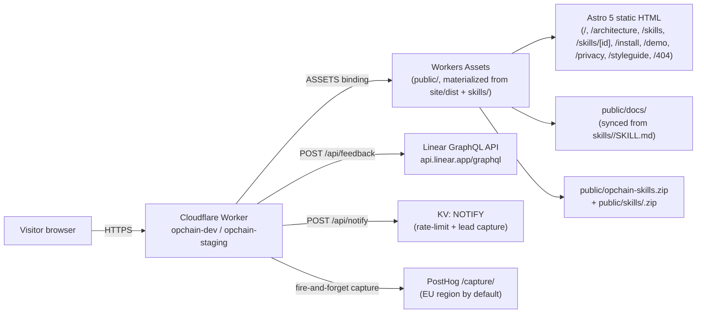
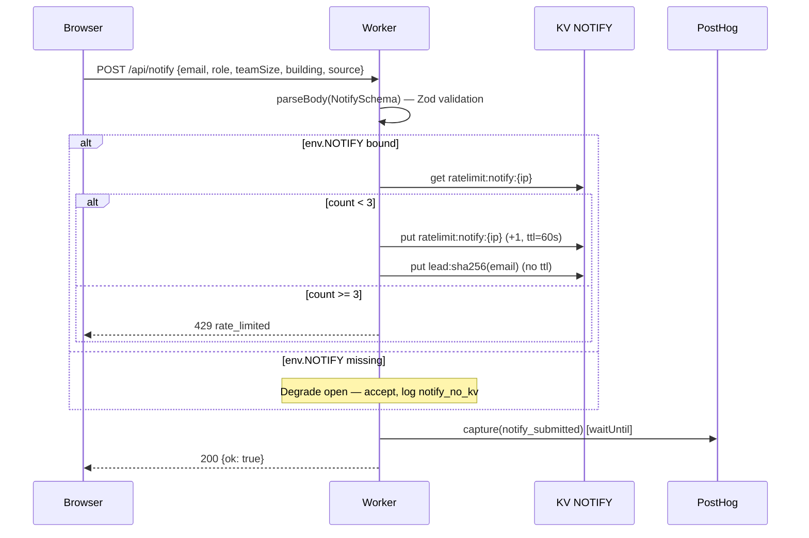
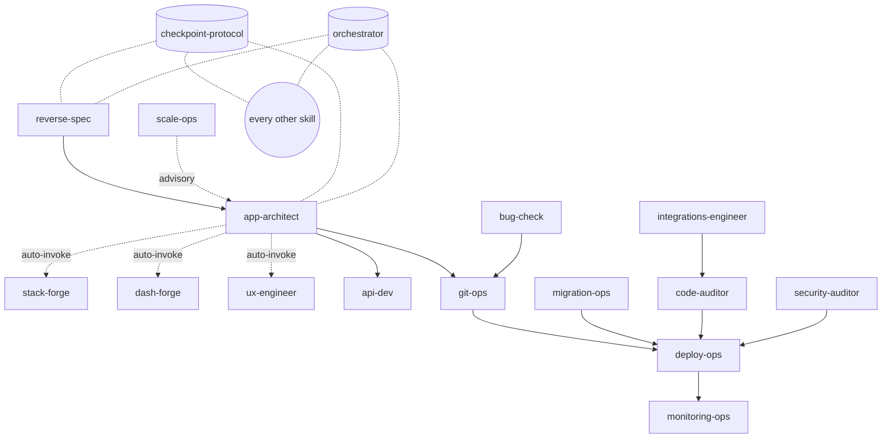

# 02 — Architecture

_Refreshed 2026-04-28 by `/reverse-spec` targeted update. Replaces the
2026-04-17 version, which described the Try-It chat topology (now
removed) and a vanilla-HTML site (since replaced by an Astro 5 build in
Sprint 6)._

This spec documents **two architectures** in one repo:

1. The **Worker + showcase site** architecture (what runs at opchain.dev).
2. The **skills ecosystem** architecture (the product itself — how the 17 skills interrelate).

---

## Part A — Worker + Showcase Site

### System diagram



### Routing

The Worker's outer `fetch` handler (`src/index.js` L449–L462) generates
a per-request UUID, calls `route()`, then unconditionally re-stamps the
baseline security headers. Inner dispatch order (`route` at
`src/index.js` L352–L447):

| Method + Path | Handler | Behavior |
|---|---|---|
| `OPTIONS /api/*` | inline | CORS preflight, `204` with origin-matched headers |
| `GET  /api/health` | inline | `{ ok, service: "opchain-dev", version }` plus `X-Opchain-Version` header |
| `POST /api/feedback` | `handleFeedback` | Zod-validated; creates Linear issue; `201` on success, `503` if `LINEAR_API_KEY` unset |
| `POST /api/notify` | `handleNotify` | Zod-validated; rate-limit (3/60s/IP); writes `lead:<sha256(email)>` to KV `NOTIFY`; fires PostHog `notify_submitted` |
| `*    /api/try/*` | inline | **`410 Gone`** — Try-It surface removed |
| `GET  /in-action`, `/tryit` | inline | `301` → `/demo` (preserves `?skill=…` query) |
| `GET  *.html` | inline | `301` → clean URL (`/foo.html` → `/foo`; `/index.html` → `/`); folds onto `/demo` if applicable |
| `GET  *.zip` | `fetchAsset` + decoration | `Content-Disposition: attachment; filename="<basename>"`, `Cache-Control: public, max-age=3600`, fires PostHog `zip_downloaded` |
| `GET  /*` (other) | `fetchAsset` | Static asset from `ASSETS` binding (`public/`); 308 → 200 redirect-follow inside the Worker |

### Security headers

Every response (HTML, JSON, binary) gets the baseline stamp from
`applyBaselineHeaders` (`src/index.js` L115–L120). HTML responses
additionally go through `applySecurityHeaders` (L122–L141) which:

1. Generates a fresh 16-byte base64url nonce per request.
2. Substitutes the build-time `__OPCHAIN_NONCE__` placeholder in the
   body with that nonce. The placeholder is stamped onto every
   `<script>` tag at build time by `scripts/inject-nonce-placeholder.mjs`
   (last measured: 105 placeholders across 20 HTML files).
3. Emits the matching `Content-Security-Policy` (see
   `03-security-auth.md` for the full policy).
4. Deletes `Content-Length` (the body length usually changed); the
   platform adds `Transfer-Encoding: chunked`.

CORS is `/api/*`-only and gates on an explicit allow-list
(`ALLOWED_ORIGINS`, `src/index.js` L37–L47). See `03-security-auth.md`
for the full table.

### Notify flow



Source: `src/index.js` L270–L342, `src/lib/schemas.js` `NotifySchema`.

### Static asset pipeline

Sprint 6 (the Astro cutover) reshaped the build. `public/` is no
longer source-of-truth; it's materialized on every build:

```
skills/<id>/SKILL.md                                      ┐
   ├──► scripts/sync-docs.sh        ──► public/docs/<id>/SKILL.md
   ├──► scripts/make-skills-zip.sh  ──► public/opchain-skills.zip + public/skills/<id>.zip
   └──► site/src/content.config.ts (Astro content collection — validates frontmatter)
                                                          │
site/src/pages/*.astro                                    │
   └──► astro build                ──► site/dist/*.html   │
                                                          │
scripts/build-site.sh:                                    │
   1. cd site && npm run build                            │
   2. snapshot public/{docs,opchain-skills.zip}           │
   3. wipe public/, copy site/dist → public/              │
   4. restore the snapshot                                │
   5. node scripts/inject-nonce-placeholder.mjs           │
                                                          │
src/index.js ──► node build.mjs (esbuild, target esnext) ─┴──► dist/index.js
                                                          │
                                       wrangler deploy (ASSETS: public/, main: dist/)
```

`npm run prebuild` is the single chain:
`gen-catalog → sync-docs → make-zip → build-site`. `npm run build`
runs `prebuild` then esbuild. `npm run deploy` runs `prebuild` then
`wrangler deploy`. The `gen-skills-catalog.mjs` step asserts every
`skills/<id>/SKILL.md` has the required frontmatter and that `name`
matches its directory — so a malformed skill fails the build before
deploy.

### Key characteristics

- **No framework on the Worker.** A 100-line `if/else` ladder in
  `src/index.js` is the entire router.
- **No ORM, no DB.** KV `NOTIFY` is the only stateful store, used as a
  rate-limit counter and a lead-capture sink.
- **No streaming endpoints.** With Try-It gone, every Worker route
  responds with a single body.
- **No job queue, no scheduled workers, no Durable Objects, no
  Hyperdrive.**
- **Idempotent header stamp.** The outer `fetch` always re-applies
  `applyBaselineHeaders` after `route()` returns, so a future handler
  that constructs a `Response` from scratch can't accidentally drop
  the baseline. Cost: setting four already-set headers.

---

## Part B — Skills Ecosystem

### Pipeline topology



### The checkpoint protocol

Every skill writes to
`{project-dir}/.checkpoints/<skill-name>.checkpoint.json`. The
canonical top-level keys (`phase`, `progress_table`, `context_primer`,
`blockers`, `next_actions`) are defined in
`skills/checkpoint-protocol/SKILL.md`; every other skill implements
them. Skill activation flow:

1. Check own checkpoint → offer resume.
2. Check **upstream** checkpoints (e.g. `app-architect` reads
   `reverse-spec`'s output).
3. If none and the user seems new, run novice mode.

Sources: `skills/orchestrator.md`, `skills/orchestrator/SKILL.md`,
`skills/checkpoint-protocol/SKILL.md`.

### Active chaining protocol

Skills don't just suggest the next step — they **actively invoke** the
next skill by reading its `SKILL.md` and running its entry command,
with context passed through the checkpoint file. The handoff matrix
(non-exhaustive — see `orchestrator.md` §"Active chaining" for the
full set):

| From | To | Trigger |
|---|---|---|
| reverse-spec | app-architect | After `/rev-full` — handoff specs as Phase 2 baseline |
| app-architect | stack-forge | Phase 2 auto-invoke for stack decision |
| app-architect | ux-engineer | Phase 3 design auto-attach |
| app-architect | dash-forge | Phase 3 if the project is data-dense |
| app-architect | api-dev | When a first-party API is in scope |
| integrations-engineer | code-auditor | Verify integration |
| migration-ops | deploy-ops | After data migration succeeds |
| bug-check | git-ops | Pre-commit gate, pass through to commit |
| code-auditor | deploy-ops | Pre-deploy quality gate |
| security-auditor | deploy-ops | Pre-deploy security gate |
| deploy-ops | monitoring-ops | Post-deploy observability check |
| any | orchestrator | `/ops next` / `/ops status` cross-cuts every skill |

### Skill typology (17 skills)

| Skill | Kind | Tri-agent? | Phase(s) |
|---|---|---|---|
| `checkpoint-protocol` | Protocol (not invokable standalone) | no | foundation |
| `orchestrator` | Pipeline coordinator | no | foundation |
| `reverse-spec` | Workflow | no | plan (from existing code) |
| `stack-forge` | Advisor | no | plan |
| `dash-forge` | Workflow | no | plan |
| `app-architect` | Unified orchestrator | yes (Generator/Evaluator) | plan + build |
| `ux-engineer` | Design harness | yes (Planner/Generator/Evaluator) | plan |
| `api-dev` | API harness | yes (Designer/Builder/Tester) | plan + build |
| `integrations-engineer` | API builder | yes (Planner/Builder/Tester) | build |
| `migration-ops` | Data-migration workflow | no | build |
| `bug-check` | Pre-commit QA gate | no | build |
| `code-auditor` | Quality loop | yes (Auditor/Fixer/Verifier) | build |
| `security-auditor` | Security loop | (review) | build |
| `git-ops` | Workflow | no | build |
| `deploy-ops` | Workflow | no | build |
| `monitoring-ops` | Post-deploy observability | no | build |
| `scale-ops` | Capacity advisor | no | (cross-cutting, advisory) |

The Astro content-collection schema validates `phases` against
`["foundation", "plan", "build"]` (`site/src/content.config.ts`); the
public site groups them into `foundation / plan / plan+build / build /
quality / ship` for legibility. The `tryable` flag in frontmatter is
preserved for backwards-compat but is no longer surfaced anywhere on
the site (the Try-It chat is gone).

### Confidence

| Claim | Confidence |
|---|---|
| 17 skills with valid frontmatter | HIGH — counted via `find skills -name SKILL.md` |
| Auto-invoke chaining inside app-architect | HIGH — orchestrator + per-skill SKILL.md |
| Checkpoints are JSON in `.checkpoints/` | HIGH — explicit in multiple skills |
| Site is fully Astro 5 static (no SSR) | HIGH — `astro.config.mjs` `output: "static"` |
| KV `NOTIFY` is the only stateful binding | HIGH — `wrangler.jsonc` lists no others |
| `tryable` frontmatter no longer drives anything | HIGH — content collection marks it `optional()` and no page consumes it |

## Gaps & Recommendations

- **The architecture page (`/architecture`) is now a real page** but
  doesn't render the Mermaid diagrams above. Consider lifting the two
  topology diagrams from this spec into the public page so the public
  story matches the internal one.
- **Checkpoint schema is still specified by prose only.** A JSON Schema
  (or TypeScript type) for the canonical checkpoint shape would let
  skills validate each other's output. Tracked in
  `stack-forge-audit.md`.
- **Two orchestrator files exist** (`skills/orchestrator.md` plus
  `skills/orchestrator/SKILL.md`). The `SKILL.md` is what the content
  collection sees and what installs; the bare markdown is a historical
  mirror. Worth a top-of-file note in the historical mirror pointing
  to the canonical one, or collapsing the duplication.
- **Per-skill ZIPs are an implicit contract.** `make-skills-zip.sh`
  emits `public/skills/<id>.zip` per skill plus the combined bundle;
  `/skills/<id>` install pages link to those URLs. If the script's
  output convention changes, every install page silently 404s. A
  cheap drift check (assert each frontmatter `name` produces a
  matching `.zip` post-build) would catch it.
